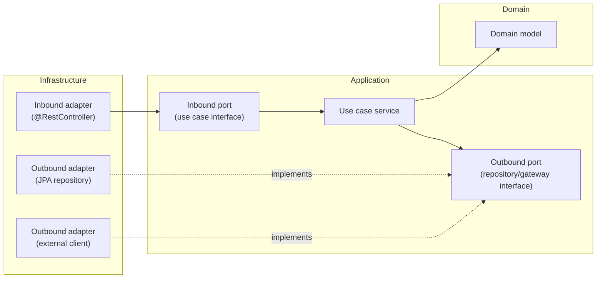

# Hexagonal Architecture (Ports & Adapters) for Spring Boot

## Overview

Keep the domain and use cases free of framework/infrastructure concerns (Spring, JPA, HTTP, Azure SDKs). All dependencies point **inward**, toward the domain. External technology is swappable behind interfaces (ports).



## Package Structure

Applied to this repo's base package `com.ambiental.iga_scanner`:

```
com.ambiental.iga_scanner
├── domain/                        # Entities, value objects, domain services — POJOs only, no Spring/JPA/Azure imports
├── application/
│   ├── port/in/                   # Inbound ports: use case interfaces (e.g. ScanDocumentUseCase)
│   ├── port/out/                  # Outbound ports: repository/gateway interfaces (e.g. DocumentRepository, EmbeddingGateway)
│   └── service/                   # Use case implementations of the inbound ports
└── infrastructure/
    ├── adapter/in/web/             # @RestController classes calling inbound ports
    ├── adapter/out/persistence/    # @Repository/JPA classes + @Entity, implementing outbound ports
    └── adapter/out/ai/             # Azure/Spring AI clients implementing outbound ports
```

## The Dependency Rule

- `domain` depends on nothing else in the project.
- `application` depends only on `domain` (and its own ports).
- `infrastructure` depends on `application` and `domain`, never the reverse.
- No `@Entity`, `@RestController`, or Azure/Spring AI client type may appear inside `domain` or `application`.

## Ports

- **Inbound port**: an interface describing a use case the outside world can invoke, e.g. `interface ScanDocumentUseCase { ScanResult scan(ScanCommand command); }`.
- **Outbound port**: an interface describing a capability the domain/application needs from the outside world, e.g. `interface DocumentRepository { void save(Document doc); Optional<Document> findById(DocumentId id); }`.
- Ports are defined by the **application layer**, in its own vocabulary — not shaped by the database schema or HTTP contract.

## Adapters

- **Inbound adapter** (driving side): `@RestController` (or a message listener) receives external input, maps it to a command, and calls the inbound port. It never talks to persistence or external clients directly.
- **Outbound adapter** (driven side): implements an outbound port. E.g. a Spring Data JPA repository class implementing `DocumentRepository`, translating between a JPA `@Entity` and the domain model with a mapper — the JPA entity itself lives in `infrastructure`, not `domain`.
- Adapters are the only place framework annotations (`@RestController`, `@Repository`, `@Entity`, `@Service` on wiring classes) should appear.

## Testing Strategy

- **Domain & application layer**: plain JUnit 5, no Spring context; mock outbound ports with Mockito to test use case orchestration in isolation.
- **Adapters**: slice tests (`@WebMvcTest` for inbound web adapters, `@DataJpaTest` for outbound persistence adapters) or Testcontainers-backed integration tests.
- A passing domain/application test suite should never require Spring, a database, or network access.

## Best Practices

1. Name ports for the capability they express (`DocumentRepository`, `EmbeddingGateway`), not for the technology behind them.
2. One inbound port per use case; avoid a single "god interface" with every operation.
3. Map at the adapter boundary — JPA entities and HTTP DTOs never leak into `domain` or `application`.
4. Wire concrete adapters to ports via Spring `@Bean`/constructor injection; the application layer only ever sees the interface.
5. When adding a new external integration (e.g. Azure AI Foundry for RAG), add an outbound port first, then an adapter implementation — don't let the domain depend on the SDK.
6. Keep domain objects and rules unit-testable without starting a Spring context.
